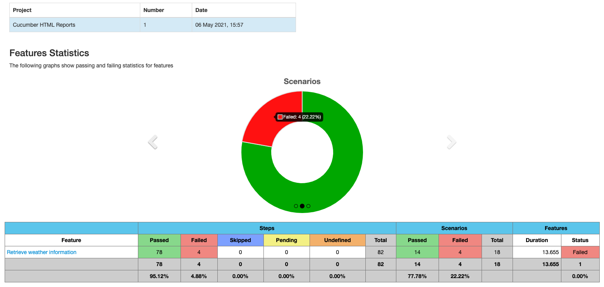
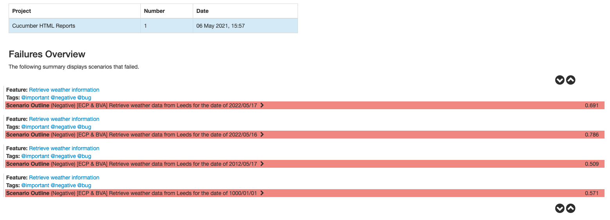
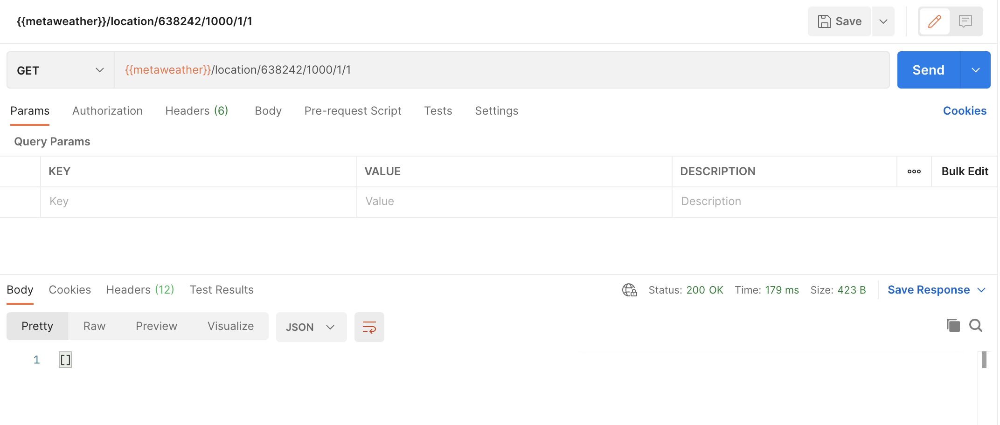

## **MetaWeather API - BDD framework with Rest Assured**

##### _Demonstrating Functional Testing with BDD, pushing boundaries through positive and negative testing, finding a bug and exposing it._
**Feature to test:**

•  As a MetaWeather API client, I want to retrieve “tomorrows” weather for “Nottingham”

**Acceptance:**

•   Ensure you consider the full anatomy of a RESTful API’s endpoint.

**Stretch Feature:**

•   A Customer has reported that they have already found a bug within the API but are unwilling to share the details. Build a feature test to expose the issue.

> API DOCUMENTATION:
> https://www.metaweather.com/api/

_Important_
>Yahoo! API for Where On Earth ID fetching service has retired, not offering replacement API!

**Util paths:**

**Get WOEID for specific Location:** 
{{metaweather}}/location/search/?query={city}

**Get 6 days Forecast for specific Location** 
{{metaweather}}/location/{woeid}

**Get detailed weather forecast for specific Location & Day:** 
{{metaweather}}/location/{woeid}/{date}
___
_THE Location Day API ENDPOINT CONTAINS A BUG THAT HAS BEEN ISOLATED THROUGH @bug TAG_
___

#### Libraries used
(Built using Maven 4)
> Java 8,
> Cucumber JVM 5,
> Cucumber JUnit 5,
> Rest-Assured 4,
> gson,
> JSON Schema Validator,
> Lombok,
> Maven Surefire 3,
> Maven Cucumber Reporting

### Execution instructions

**After cloning the project please follow the below instructions:**
##### 1. Open Terminal and make sure you are in the _meta-weather-api-bdd_ folder by typing:
`cd ~/; cd $(find **/meta-weather-api-bdd -type d -name meta-weather-api-bdd)`
##### 2. Input following maven command to verify and generate report (failed build due to bug):
`mvn clean verify`
##### 3. If you want to run the tests that _excludes_ the bug please run:
`mvn clean verify -Dcucumber.filter.tags="not @bug"`
##### 4. If you want to run the tests that _isolates_ the bug please run:
`mvn clean verify -Dcucumber.filter.tags="@bug"`
##### 5. Finally, to open the report directly in default browser please run:
`open target/cucumber-html-reports/overview-features.html`
___
#### Approach
The API has been initially tested manually through POSTMAN with a test-to-break approach using Equivalence Class Partitioning and Boundary Value Analysis after Exploratory Testing.
Not having a clear documentation to emphasize API endpoints' boundaries and not having access to a PO/BA for business logic meetings, it has been concluded that multiple defects arose together with a Bug and have been mentioned in the document bellow:
___

###  **Part Two:** Questions + Answers
        •  Explain why you chose to use those particular tools/frameworks in the technical challenge?
   > Using open source tools generates low costs for business
   > 
   > Java comes as a strong pillar in building comprehensive testing framework
   > 
   > Rest-Assured library with HamcrestMatchers afford offering a clear BDD view over implementation
   > 
   > As structure is not volatile and contains large payload schemas, POJO would improve on writing and maintaining test scripts
   > 
   > gson library would have been used to serialize-deserialize using POJOs
   > 
   > Lombok library helping with @Data public interface that cuts down huge amount of code on POJOsby replacing @Getter @Setter @RequiredArgsConstructor @ToString @EqualsAndHashCode
   > 
   > BDD framework makes it easy to chat for the 3 amigos, having clear process, fast resilient implementation, scalable framework, systematic and transparent approach
   > 
   > The volume of test data is fitting Scenario Outline soft boundaries.

        •  Describe the reason for the scope of your solution. Why did you test what you did, and why didn’t you test other things?

   > The user can only choose from current year weather statuses, hence would not test other years' boundaries
   >
   > scaling up, I negatively tested direct woeID URI manipulation and its boundaries with specific payload result
   >
   > Out of scope to test Lat+Long as not testing map feature, but focusing on knowing the location name instead

        •  What questions would you ask your Product Owner / what information would you need to know, 
            to be able to test the whole MetaWeather API service comprehensively?

   > Should the Location&Day endpoint return the a schema including location as well or is this a bug (it is missing)?
   > 
   > Should the past weather data records start from same date or not? They are actually having a random start in DB.
   > 
   > Would the Location&Day endpoint hold a specific forecast date offset instead of a range? (testing the range resulted in rugged forecast for different woeID!)

        •  After completing the technical challenge, what would you do differently if you were asked to do the same challenge again?

   > Having extra time and more business logic/knowledge around the API endpoints, I would optimise the actual test framework and extend testing area and approach, for example the user can access each ID of weather history, focusing on ECP and BVA as there are over 60 IDs for each Location&Day combo
   > 
   > Also would focus more on payload definition and logics, but definitely by implementing POJO classes instead and adding extensive Payload Schema Validation
   > 
   > "Most location have data from early 2013 to 5-10 days in the future." -> NOT Specific as a Requirement Criteria, otherwise user getting: '500 - Server error Oups, something went wrong. Sorry."

## BUGS FOUND:

_Getting outside both lower and upper boundaries in UI would trigger:_
> Bugs  
> > Actual status code 500 (Server Error) whilst expecting 404 (Not Found)
AND whilst API would give 200 with an empty list in the payload, where expecting 404 as well
> 
> Defects description:
> >  Documentation not respected and not precise (ragged data boundaries found)
> 
> > UI not reflecting API status code and payload
> 
> ___
> API response behavior: 
> > _Status Code 404_ for test data woeID: 30720, Date: 999/12/31. this needs to be changed to 2013/01/01
> 
> > _Status Code 200_ for test data woeID: 30720, Date: 1000/1/1, 2012/5/17 where documentation mentions data availability from 2013 towards 5-10 days relative to Today's date. 
> 

_More details from Documentation needed, PO/BA would help in this situation._

